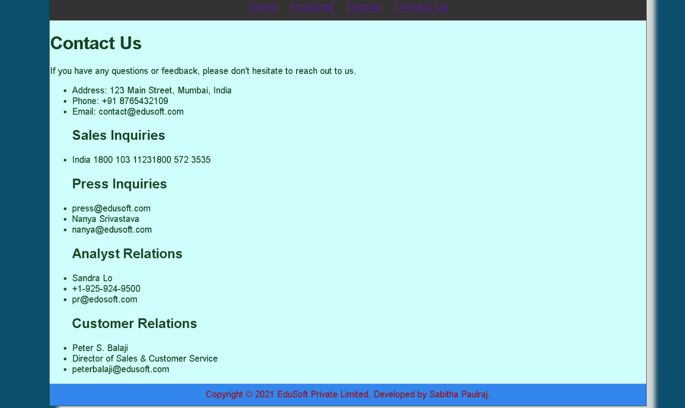

# Web Design for a Software Product Company

## AIM:

To design a static website for a software product company company.

## DESIGN STEPS:

### Step 1:

Requirement collection.

### Step 2:

Creating the layout using HTML and CSS.

### Step 3:

Updating the sample content.

### Step 4:

Choose the appropriate style and color scheme.

### Step 5:

Validate the layout in various browsers.

### Step 6:

Validate the HTML code.

### Step 6:

Publish the website in the given URL.

## PROGRAM :
## people.html:
```
<!DOCTYPE html>

<html lang="en">
  <head>
    <title>YUMAHA-Private Limited</title>
    <link rel="stylesheet" href="layout.css" />
    <link rel="icon" href="static/images/icon.png" type="image/x-icon" />
  </head>

  <body>
    <div class="container">
      <div class="banner">YUMAHA-Private Limited.</div>
      <div class="menu">
        <div class="menuitem"><a href="home.html">Home</a></div>
         <div class="menuitem">
          <a href="product.html">Products</a></div>
        <div class="menuitemselected"><a href="people.html">People</a></div>
        <div class="menuitem"><a href="contact.html">Contact Us</a></div>
        
        <div class="content">
        <div class="productcontent">    
          <h1>People Of Company </h1>
          <figure>

        
        <p>
             
        </p>
        <figcaption> <h2>PRESIDENT</h2></figcaption>
        <hr>
        
      
        <p>
             
        </p>
        <figcaption> <h2>FOUNDER</h2></figcaption>
        <hr>
        
        
       <p>
             
        </p>
        <figcaption> <h2>CO-FOUNDER</h2></figcaption>
        <hr>
        
        
        <p>
             
        </p>
        <figcaption> <h2>DIRECTOR</h2></figcaption>
        <hr>
        
        
        <p>
             
        </p>
        <figcaption> <h2>MANAGER</h2></figcaption>
        <hr>

        <p>
             
        </p>
        <figcaption> <h2>HEAD</h2></figcaption>
        <hr>
       </figure>
          </div>
      </div>
       <div class="footer">
       Copyright &#169; 2022 YUMAHA-Private.LTD, Developed Bala Sudhan
     </div>
    </div>
  </body>
</html>
```
##product.html
```
<!DOCTYPE html>

<html lang="en">
  <head>
    <title>Aj-Private Limited</title>
    <link rel="stylesheet" href="layout.css" />
    <link rel="icon" href="static/images/icon.png" type="image/x-icon" />
  </head>
  <body>
    <div class="container">
      <div class="banner">YAMAHA-Private Limited.</div>
      <div class="menu">
        <div class="menuitem"><a href="home.html">Home</a></div>
        <div class="menuitemselected">
          <a href="product.html">Products</a>
        </div>
        <div class="menuitem"><a href="people.html">People</a></div>
        <div class="menuitem"><a href="contact.html">Contact Us</a></div>
    </div>
      <div class="content">
        <div class="productcontent">    
          <h1>Our Premium Products</h1>
          <div class="productitems">
              <div class="productitem"> 
                  <div class="itemimage">
                  
                  </div>
                  <div class="itemname">Tally Gold</div>
                  <div class="itemprice">Price: Rs.40,000.00 </div>
              </div>
              <div class="productitem"> 
                  <div class="itemimage">
                  
                  </div>
                  <div class="itemname">Tally Silver</div>
                  <div class="itemprice">Price: Rs.10,000.00 </div>
              </div>

              <div class="productitem"> 
                  <div class="itemimage">
                  
                  </div>
                  <div class="itemname">Tally Simple Steps</div>
                  <div class="itemprice">Price: Rs.12,000.00 </div>
              </div>

              <div class="productitem"> 
                  <div class="itemimage">
                  
                  </div>
                  <div class="itemname">Tally Author edision </div>
                  <div class="itemprice">Price: Rs.14,000.00 </div>
              </div>

              <div class="productitem"> 
                  <div class="itemimage">
                  
                  </div>
                  <div class="itemname">Tally GST</div>
                  <div class="itemprice">Price: Rs.15,000.00 </div>
              </div>

              <div class="productitem"> 
                  <div class="itemimage">
                  
                  </div>
                  <div class="itemname">Tally PRIME</div>
                  <div class="itemprice">Price: Rs.18,000.00 </div>
              </div>

              <div class="productitem"> 
                  <div class="itemimage">
                  
                  </div>
                  <div class="itemname">Tally Essential</div>
                  <div class="itemprice">Price: Rs.11,000.00 </div>
              </div>

              <div class="productitem"> 
                  <div class="itemimage">
                  
                  </div>
                  <div class="itemname">Tally Power of simplcity </div>
                  <div class="itemprice">Price: Rs.13,000.00 </div>
              </div>

              <div class="productitem"> 
                  <div class="itemimage">
                  
                  </div>
                  <div class="itemname">Tally Impleating</div>
                  <div class="itemprice">Price: Rs.14,000.00 </div>
              </div>

              <div class="productitem"> 
                  <div class="itemimage">
                  
                  </div>
                  <div class="itemname">Tally Advance</div>
                  <div class="itemprice">Price: Rs.20,000.00 </div>
              </div>

              <div class="productitem"> 
                  <div class="itemimage">
                  
                  </div>
                  <div class="itemname">Tally GST 4th edision</div>
                  <div class="itemprice">Price: Rs.19,000.00 </div>
              </div>  
          </div>
          </div>        
      </div>
      <div class="footer">
        Copyright &#169; 2022 YAMAHA-Private.LTD, Developed by Bala Sudhan
      </div>
    </div>
  </body>
</html>
```
## home.html
```
<!DOCTYPE html>
<html lang="en">
  <head>
    <title>AJ Private Limited</title>
    <link rel="stylesheet" href="layout.css" />
    <link rel="icon" href="./img/icon.png" type="image/x-icon" />
  </head>

  <body>
    <div class="container">
      <div class="banner">YAMAHA Private Limited.</div>
      <div class="menu">
        <div class="menuitemselected"><a href="home.html">Home</a></div>
        <div class="menuitem"><a href="product.html">Products</a></div>
        <div class="menuitem"><a href="people.html">People</a></div>
        <div class="menuitem"><a href="contact.html">Contact Us</a></div>
      </div>
      <div class="content">
        <div class="homecontent">
          <h1>About Us</h1>
          
          <div class="contenttext">
            At Tally, we believe in the power of technology to make business
            owners efficient, empowered and happier, so they can focus on what
            matters most for their business. We design our products to focus on
            just that to make our products work for you, and not the other way
            around.
            <br />
            Our new product TallyPrime takes this to a new level, making your
            start to automation, or your switch to Tally simpler than ever
            before. You can now discover the product much more easily and make
            the product do more for you, without learning anything new. There is
            greater flexibility as the product adapts to your business and your
            way of working. And the transformed look and feel will only make you
            love the product even more.
            <ul>
              <li>Simple to learn, easier to use</li>
              <li>Insightful , actionable & customizable reports</li>
              <li>Anywhere, anytime and secure access</li>
            </ul>
          </div>
        </div>
      </div>
      <div class="footer">
        Copyright &#169; 2021 YAMAHA Private Limited, Developed by Bala Sudhan
      </div>
    </div>
  </body>
</html>
```
## contact.html
```
<!DOCTYPE html>

<html lang="en">
  <head>
    <title>Aj</title>
    <link rel="stylesheet" href="layout.css" />
    <link rel="icon" href="static/images/icon2.png" type="image/x-icon" />
  </head>

  <body>
    <div class="container">
      <div class="banner">YAMAHA-Private Limited</div>
      <div class="menu">
        <div class="menuitem"><a href="home.html">Home</a></div>
        <div class="menuitem"><a href="product.html">Products</a></div>  
        <div class="menuitem"><a href="people.html">People</a></div>
        <div class="menuitemselected"><a href="contact.html">Contact Us</a></div>
      </div>
      
        <div class="content">
           <h1>Our Contact Address</h1>  
        
          <div class="contacttext">
           Phone:8248999999
           <br>Email-address:ajprivatelimited@email.com
          </div>
        </div>

     
<div class="footer">
  Copyright &#169; 2022 YAMAHA Private.LTD, Developed by Bala Sudhan
</div>
</div>
</body>
</html>
```
## OUTPUT:

### Home Page:



## Result:

Thus a website is designed for the software product company and the HTML,CSS code are validated.
